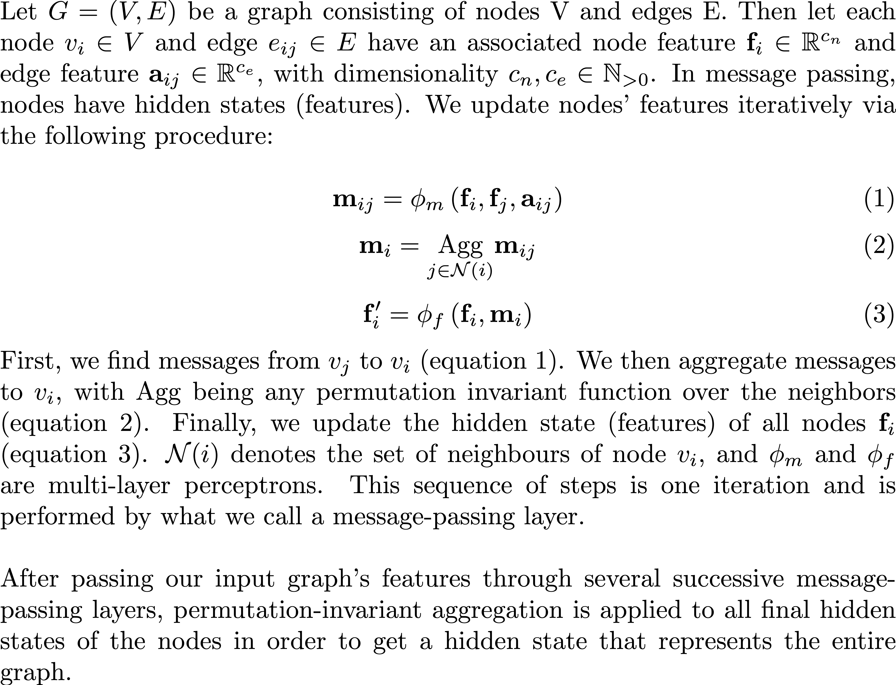
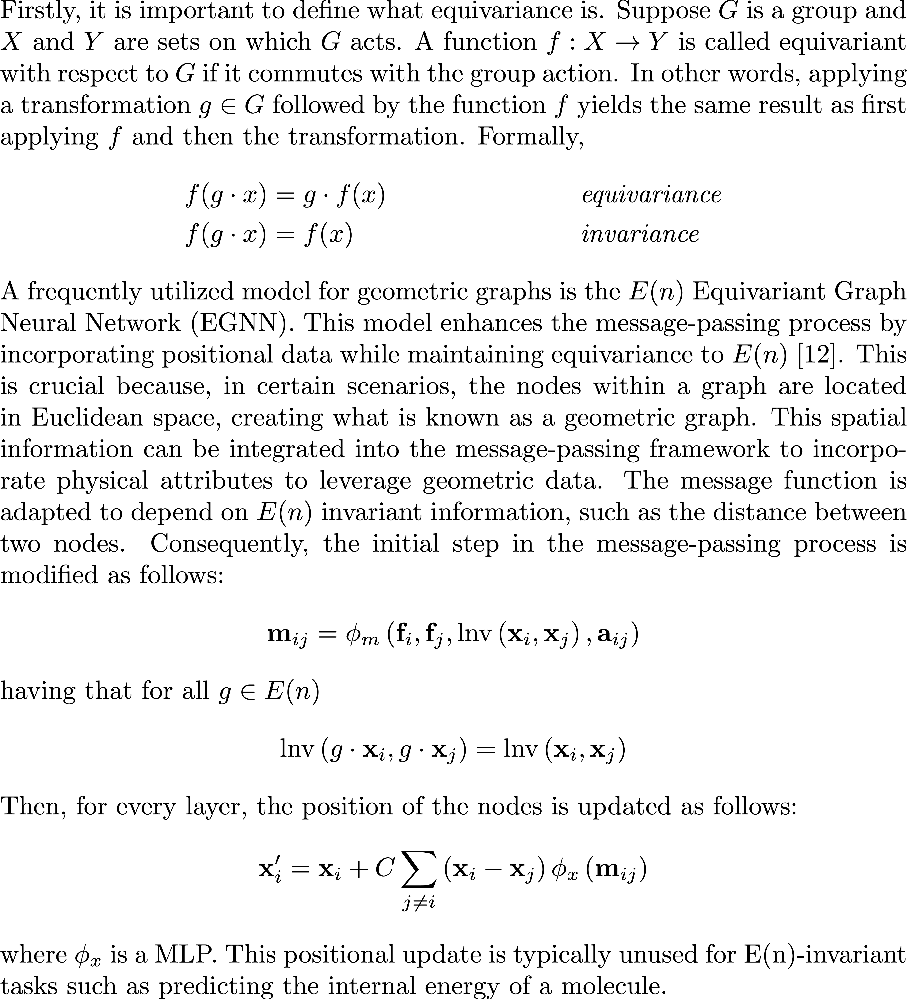
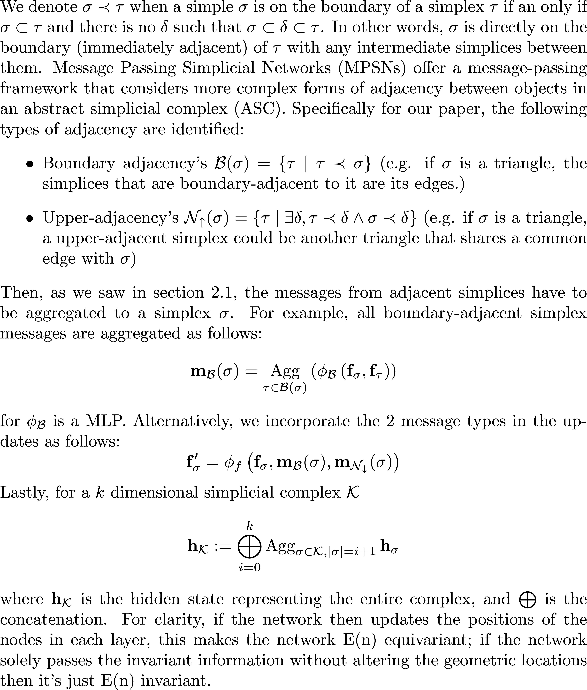
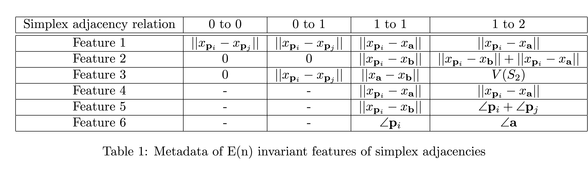
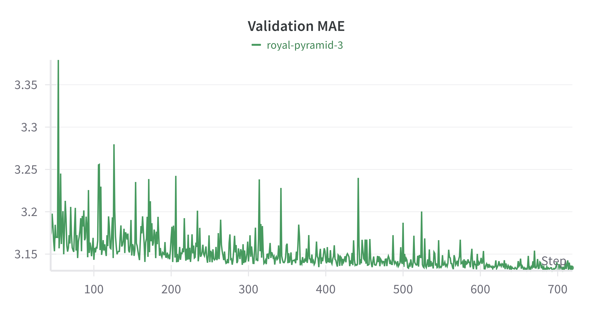
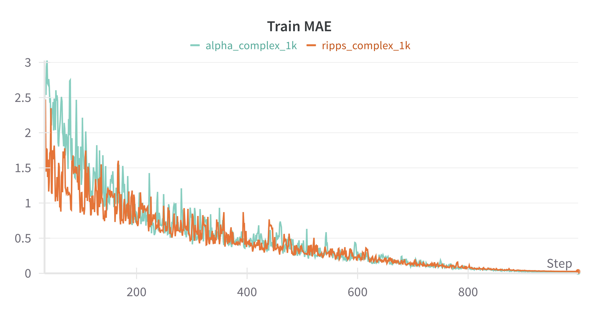
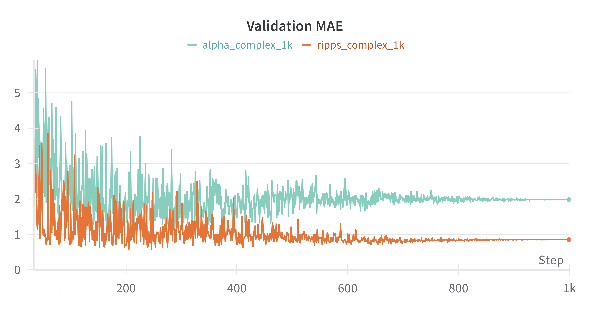

## 1 Introduction

Over the past few years, deep learning research has seen significant progress in solving graph learning tasks. A crucial aspect of such problems is maintaining equivariance to transformations, such as rotations and translations, allowing for instance, to reliably predict physical properties of molecules. In this section, we will provide an overview of the predominant methods used in this domain, along with an introduction to a new method: E(n) Equivariant Simplicial Message Passing Networks (EMPSNs) [3].

Graph Neural Networks (GNNs) [13], namely their most common variant, Message Passing Neural Networks (MPNNs) [5] are instrumental for learning on graph data. Simple MPNNs however, have a number of drawbacks. Firstly, they are limited in their ability to learn higher-dimensional graph structures such as cliques (a set of points that are all connected to each other), since communication normally only happens from nodes to other nodes. Secondly, they suffer from over-smoothing; nodes of a graph iteratively update their features by aggregating the features of their neighbors, a process by which updated node features become increasingly similar. Previous works attempt to improve MPSNs’ expressivity by considering higher-dimensional simplices in the graph as learnable features [1] [8]. While these methods provide the tools for more powerful graph learning models, they do not concern themselves with equivariance.

As stated in the original EMPSN [3] paper, many real-life problems have a natural symmetry to translations, rotations, and reflections (that is, to the Euclidean group E(n)), such as object recognition or predicting molecular properties. Many approaches have been proposed to ensure E(n) equivariance: Tensor field networks [14], SE(3) Transformers [4], E(n) Equivariant Graph Neural Networks [12] among others. These works are particularly useful for working with geometric graph data, such as molecular point clouds; they use the underlying geometry of the space in which the graph is positioned to ensure E(n) equivariance. In this case, however, the lack of higher-dimensional features remains a limiting factor for the reasons stated previously. EMPSNs [3] are a novel approach to learning on geometric graphs and point clouds that is equivariant to the euclidean group E(n) (rotations, translations, and reflections). The method combines geometric and topological graph approaches to leverage both benefits. Its main contributions related to our reproduction study are the following:

1. A generalization of E(n) Equivariant Graph Neural Networks (EGNNs), which can learn features on simplicial complexes.
2. Experiments showing that the use of higher-dimensional simplex learning improves performance compared to EGNNs and MPSNs without requiring more parameters and proving to be competitive with SOTA methods on the QM9 dataset [11], [10].

Additionally, their results suggest that incorporating geometric information serves as an effective measure against over-smoothing.

In our work, we attempt to reproduce the results of the original EMPSN paper and extend the method, rewriting parts of the author’s code to use a common suite for learning on topological domains. The suite allows us to test how a different graph lifting procedure (an operation that obtains higher-order simplices from graph data) compares to the one used in the original paper.

## 2 Theoretical background

Message passing neural networks have seen an increased popularity since their introduction [5]. In this blogpost, we will elaborate on how message passing networks are adapted to work with simplicial complexes, as proposed by [3]. We introduce the relevant definitions of message passing, simplicial complexes, equivariant message passing networks and message passing simplicial networks.

### 2.1 Message passing

### 2.2 Simplicial complexes

### 2.3 Equivariant Message Passing Networks

### 2.4 Message passing simplicial networks

## 3 Methodology

### 3.1 Lifted representation of the dataset

QM9 is a dataset of stable small organic molecules with geometric, energetic, and thermodynamic properties. It contains important quantum chemical properties and serves as a standard benchmark for machine learning methods or systems of identifications of the contained molecular properties. The QM9 dataset consists of molecular graphs with 19 graph-level features. The nodes of the molecular graphs are atoms embedded in a three-dimensional Euclidean space. The goal of the methodology for QM9 is graph feature prediction, and since the features are continuous values, this is a regression task. The molecular graphs present in QM9 contain no higher-order topological information. To address this limitation, we propose to lift the graph structure to facilitate the construction of different order simplices.

To do this, we *lift* the point cloud to a Vietoris-Rips complex based on a parameter $\delta$ as described in Figure 2. There is a limit on the maximum rank of the simplices; however, due to naturally occurring phenomena, it can be constrained. For this particular set of experiments, it is restricted to rank 2. Additionally, this work presents two types of communication among simplices: 1) from $r$-simplices to $r$-simplices and 2) from $(r-1)$-simplices to $r$-simplices, however, we do not use $2$-simplices to $2$-simplices, as in [3]. It is not exactly clear why, other than the increased computational cost might be too high for the added benefit.

In addition to lifting of the structure to a higher-order topological structure, we will also lift the features to embed each $r$-simplex with a certain feature vector. We experiment with three methods: 1) A sum projection of the lower boundary of the simplex; 2) a mean projection of the lower boundary simplices; and 3) a mean of the 0-simplex components composing all lower boundary simplices, as shown in the figure and as worked out in [3]. Additionally, we also used a lift to the Alpha Complex. The alpha complex is a subcomplex of the Čech complex under the condition that the radius of the Čech complex is chosen to be $\sqrt{\alpha}$, where $\alpha$ is the parameter defining the alpha complex. Identical to the simplicial complexes, Alpha complexes are constructed until the second order. The motivation for this upper limit is to contain computational demands of training EMPSN within reasonable bounds. The invariant information is included as abstract edge attribute information between a simplex boundary within a communication framework. The simplex boundary features are shown in the table below:

In this table, the same point variables are used as in the original paper. $V(S_2)$ denotes the volume of the second order simplex, corresponding to the Volume feature in section 3.2 of the original paper.  As can be seen, some values occur twice in a simplex adjacency relation. The second time the same value occurs is because the volume of a 1d simplex is identical to the distance between its points.

### 3.2 Deep Learning Architecture

This work proposes a step toward standardization in the field of TDL by using TopoX [6], a suite of Python packages that construct a base framework for constructing Complexes (Simplicial, Combinatorial, Cellular) [7], applications of spectral graph theory algorithms and examples of SOTA topological deep learning architecture. The lifting of the topology to a higher-order structure and the lifting of features is decoupled and easily added to any standard data loading procedure, a standardized structure for message passing as a convolutional layer, and methods for structuring a TDL project. This approach makes for faster experimentation as it makes experiments replicable and interpretable. The construction of the invariance can performed as a pre-processing step or during the forward pass, the latter accounts for an equivariant architecture where the geometric information of the nodes in the graph are updated.

## 4 Original Paper

The current paper applies the theory outlined above to two proof-of-concept studies. Since the first experiment is the focus of the paper and the code for the second experiment is not provided, we will gain more insight into the first experiment. This experiment utilizes the QM9 dataset and an Invariant MPSN with seven hidden layers and 77 hidden dimensions. The QM9 dataset is a dataset of molecules, and the task is to predict certain molecular properties that these molecules exhibit. Performance is measured using Mean Absolute Error (MAE), which is also the loss function for IMPSN. The initial graph structure of the molecules is dropped and a new hierarchical graph structure is created by the lifting operation, using the Vietoris-Rips lift. After the transformation, the network is trained for 1000 epochs and only 1 feature is predicted per network.

## 5 Author contribution

Our contribution can be summed up in three main points:
- Refactoring of the original code to follow the guidelines of the TopoX suite framework. This includes the original topological lift and the feature lifting. TopoX creators have placed a request for people to translate lifting operations into their framework. Both these additions are qualitatively useful additions to not only the current paper, streamlining and clarifying the procedures, but also the TopoX suite, by increasing code written by their standards.
- Implementation of the lifting procedure for the Alpha Complex and two different feature lifting procedures using projection sum and mean projection over lower simplices.
- Application of the equivariance property on the MQ9 dataset 

## 6 Experiments and Results

Our code is located in this forked repository: [https://github.com/DL2-UvA/challenge-icml-2024](https://github.com/DL2-UvA/challenge-icml-2024)

### 6.1 Replication

The first attempt at replication was using the authors' first code. Some of the shortcomings were the difficulty of dealing with tensor stacking for mini-batching, the transformation of molecular properties, and index matching on the message-passing layer. Aside from that, the code was able to be run out of the box.

In the original implementation, MAE drops quickly but stabilizes around the 3 mark. This is far from the reported value in the paper of 0.066. This came about due to some fixes on the indices and was the maximum it dropped on all approaches. On the *H* property, the MAE was on the order of thousands, way above the reported error even when taking into account the factor change of units.

### 6.2 TopoX refactor

We executed and refactored the original code and adapted it to the TopoX framework. This included reworking the procedures for passing messages, aggregating messages using the scatter procedure, and correctly handling the invariant information along the simplices. We used communication between all simplices among $r$-simplices except on dimension and communication from lower to higher simplices for the two possible pairs. This implies that the maximum dimension was capped at 2 and the $\delta$ value was set as 3. We tried precomputing the invariances to no avail as the memory requirement becomes too high, so we remained with the original method by calculating invariances on the forward pass for a particular batch.

*Figure 1: Train MAE - TopoX*

Figure 1 shows the MAE on the Vietoris-Rips complex of the QM9 dataset trained on 1000 randomly sampled instances. It decreases steadily over time, reaching a minimum of 0.012. 

*Figure 2: Validation MAE - TopoX*

Figure 2 shows a more complete picture, calculated over 100 instances, reflecting a stagnation of the actual performance of the model and overfitting toward the end. The minimum MAE is 0.85.

### 6.3 Alpha Complex

We used the same parameter for executing the Alpha Complex. The only change incurred is capping the dimensionality of the resulting lifted topology. The lifting procedure for Alpha Complex implies that the higher $r$-simplex is not capped. Thus, we need to satisfy some constraints in regards to our architecture: 1) the maximum dimension should be capped to 2, and 2) there needs to be at least one $r$-simplex for each $r$ up to 2. In this case, this amounts to making sure the maximum dimension is at least 2; if not, then the graph is not included in the training/validation/test dataset.

Figure 1 shows the training MAE of applying the Alpha Complex lift on 1000 randomly sampled instances of the dataset. It is very similar to the Vietoris-Rips Complex, except in the first 50 epochs where it is outperformed. Figure 2 shows that the overall performance of the Alpha Complex is lower than the Vietoris-Rips complex for this task. We assume this is likely due to the fact that Alpha complex creates fewer (higher order) simplices, which might lead to a worse outcome, especially on this dataset.

## 7 Strengths and Weaknesses

The invariant geometric framework combined with the topological information generated by the lifting operation is a unique strength of the proposed methodology. It enables a data-efficient learning procedure with comparable results to state-of-the-art (SotA) methods. Even though the proposed methodology is not engineered for a specific scientific domain and does not employ a large network, it is comparable to or outperforms more specialized methods (that utilize domain-specific strategies) on certain features and consistently outperforms EGNN.

Another strength is the general applicability of this method. The proposed equivariant simplicial message passing network (EMPSN) is applicable to any geometric graph dataset. In addition, the results suggest that the incorporation of geometric information in the message passing procedure combats the over-smoothing of node features, a common problem in graph neural networks (GNNs).

Although on paper, the methodology scores very well, the current implementation has some weaknesses.

A key weakness is related to the geometric realization of the simplices. In the original paper, the author explains three $E(n)$ equivariant features—distance, angle, and volume—calculable for any dimensional simplex adjacency relation. In practice, these features are not always expressive or are identical in lower-dimensional simplices. When analyzing the metadata of each adjacency relation, it becomes clear some features are consistently 0 or appear twice. For instance, two of the three features of the 0-0 adjacency relation are 0. This happens when the volume of the two points is calculated. Other feature values occur twice in the same boundary relation. For instance, the volume of a 1D simplex is identical to the distance between the points of that 1D simplex. Yet both features exist in the metadata for the 1-1 adjacency relation. More than one-third of the invariant features are 0 or appear twice in the same adjacency relation. Since message passing only occurs between adjacency boundaries and not among different boundaries, there is full flexibility in feature selection; thus, it leaves to be questioned why the author decided on the original invariant feature metadata for each adjacency relation. In neither the paper nor the codebase can a justification be found regarding decisions on invariant feature selection.

What ties into the aforementioned weakness is the fact that the codebase has very poor readability and provides little context. In addition, the codebase contains ample hard-coded functionality and is tightly coupled. Expanding the methodology to higher-order simplices would require a significant overhaul of multiple key classes and an understanding of their coupling. The combination of cryptic variable names, lack of documentation, and extensive use of hard-coded functionality make adapting the methodology difficult.

The last weakness relates to the scope of the codebase. The original paper describes two experiments: one using an Invariant MPSN and one that uses the full Equivariant MPSN. Unfortunately, the code for the latter is not included in the paper; therefore, the results of the equivariant MPSN are not reproducible.

Given the fact the results in the original paper are impressive, it raises the question of how much the performance of the methodology could be further improved given the aforementioned seemingly unoptimal design choices surrounding the invariant features. Although the concept of the proposed methodology is original and its theoretical foundation is thoroughly explained, there are some uncertainties relating to the implementation of EMPSN.

## 8 Conclusion

In this post, we have investigated a novel ‘proof of concept’ study that investigates the use of simple structures combined with geometric properties as a useful avenue to study. the paper designs an equivariant or invariant message-passing simplicial network. It seems that the author is fair in his assessment of its utility. It is a compact network and the usage of invariance combined with simplicity seems prudent, although the accuracy of the predictions seems to not reach the same level as the original paper. We name a couple of our strengths and weaknesses, focusing on efficiency and generalisability. While also remarking the difficulty of the code and its implementation. By refitting the code into a promising new suite for topological deep learning, named TopoX, we hope to make the code more accessible and contribute to the growing number of papers using TopoX.

## 9 Contributions

- Nordin Belkacemi: focused on the code and theory
- Andreas Berentzen: implemented lifting code and invariance feature calculation and wrote strengths and weaknesses for the blog post
- Martin Carrasco: the main code writer, implemented the lifting code and the EMPSN neural network
- Valeria Sepicacchi: wrote the theoretical background and helped with EMPSN code
- Jesse Wonnink: wrote the rest of the blog post and helped with EMPSN code

## References

[1] Cristian Bodnar et al. Weisfeiler and Lehman Go Topological: Message Passing Simplicial Networks. arXiv:2103.03212 [cs]. June 2021. url: http://arxiv.org/abs/2103.03212 (visited on 05/27/2024).

[2] Erik Carlsson and John Carlsson. Computing the alpha complex using dual active set methods. arXiv:2310.00536 [cs, math]. Sept. 2023. url: http://arxiv.org/abs/2310.00536 (visited on 05/27/2024).

[3] Floor Eijkelboom, Rob Hesselink, and Erik Bekkers. E(n) Equivariant Message Passing Simplicial Networks. arXiv:2305.07100 [cs]. Oct. 2023. url: http://arxiv.org/abs/2305.07100 (visited on 05/27/2024).

[4] Fabian B. Fuchs et al. SE(3)-Transformers: 3D Roto-Translation Equivariant Attention Networks. arXiv:2006.10503 [cs, stat]. Nov. 2020. doi: 10.48550/arXiv.2006.10503. url: http://arxiv.org/abs/2006.10503 (visited on 05/27/2024).

[5] Justin Gilmer et al. Neural Message Passing for Quantum Chemistry. arXiv:1704.01212 [cs]. June 2017. url: http://arxiv.org/abs/1704.01212 (visited on 05/27/2024).

[6] Mustafa Hajij et al. TopoX: A Suite of Python Packages for Machine Learning on Topological Domains. arXiv:2402.02441 [cs, stat]. Feb. 2024. doi: 10.48550/arXiv.2402.02441. url: http://arxiv.org/abs/2402.02441 (visited on 05/27/2024).

[7] Mustafa Hajij et al. TopoX: A Suite of Python Packages for Machine Learning on Topological Domains. arXiv:2402.02441 [cs, stat]. Feb. 2024. url: http://arxiv.org/abs/2402.02441 (visited on 05/27/2024).

[8] Christopher Morris et al. Weisfeiler and Leman Go Neural: Higher-order Graph Neural Networks. arXiv:1810.02244 [cs, stat]. Nov. 2021. url: http://arxiv.org/abs/1810.02244 (visited on 05/27/2024).

[9] Mathilde Papillon et al. Architectures of Topological Deep Learning: A Survey of Message-Passing Topological Neural Networks. arXiv:2304.10031 [cs]. Feb. 2024. url: http://arxiv.org/abs/2304.10031 (visited on 05/27/2024).

[10] Raghunathan Ramakrishnan et al. “Quantum chemistry structures and properties of 134 kilo molecules”. en. In: Scientific Data 1.1 (Aug. 2014). Publisher: Nature Publishing Group, p. 140022. issn: 2052-4463. doi: 10.1038/sdata.2014.22. url: https://www.nature.com/articles/sdata201422 (visited on 05/27/2024).

[11] Lars Ruddigkeit et al. “Enumeration of 166 Billion Organic Small Molecules in the Chemical Universe Database GDB-17”. en. In: Journal of Chemical Information and Modeling 52.11 (Nov. 2012), pp. 2864–2875. issn: 1549-9596, 1549-960X. doi: 10.1021/ci300415d. url: https://pubs.acs.org/doi/10.1021/ci300415d (visited on 05/27/2024).

[12] Victor Garcia Satorras, Emiel Hoogeboom, and Max Welling. E(n) Equivariant Graph Neural Networks. arXiv:2102.09844 [cs, stat]. Feb. 2022. url: http://arxiv.org/abs/2102.09844 (visited on 05/27/2024).

[13] F. Scarselli et al. “The Graph Neural Network Model”. In: IEEE Transactions on Neural Networks 20.1 (Jan. 2009), pp. 61–80. issn: 1045-9227, 1941-0093. doi: 10.1109/TNN.2008.2005605. url: http://ieeexplore.ieee.org/document/4700287/ (visited on 05/27/2024).

[14] Nathaniel Thomas et al. Tensor field networks: Rotation- and translation-equivariant neural networks for 3D point clouds. arXiv:1802.08219 [cs]. May 2018. doi: 10.48550/arXiv.1802.08219. url: http://arxiv.org/abs/1802.08219 (visited on 05/27/2024).
